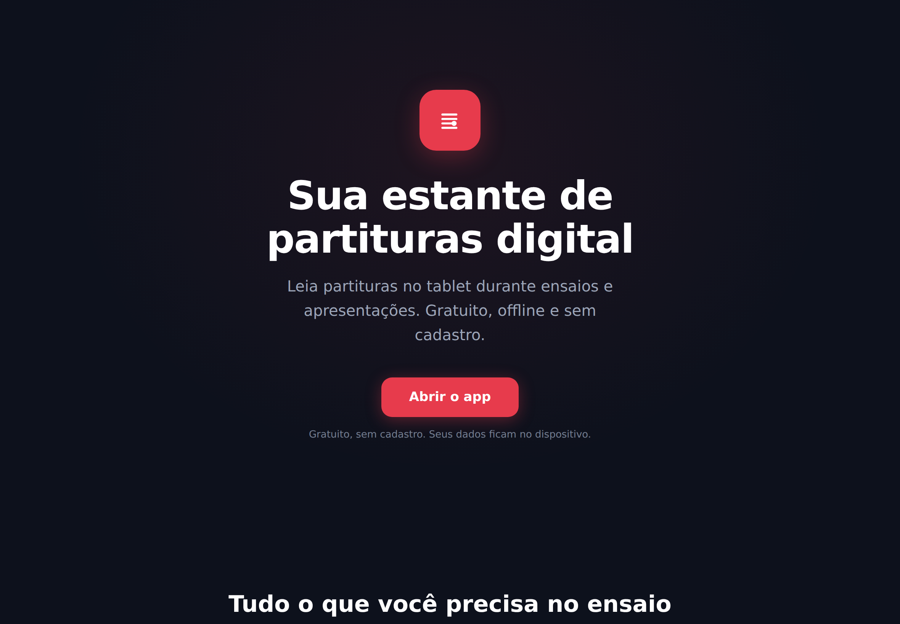
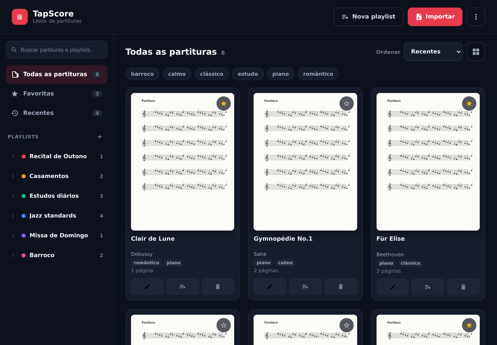
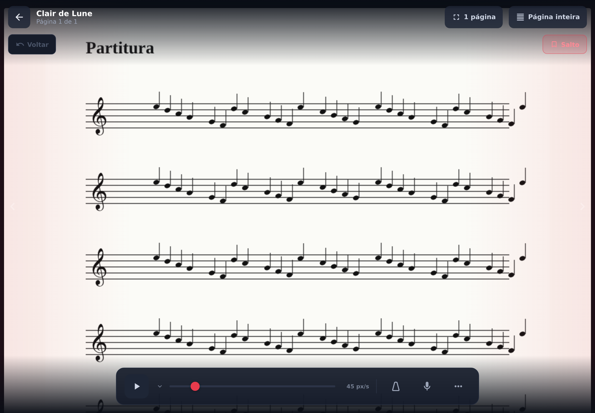

<div align="center">


# TapScore

### Seu leitor de partituras no tablet — gratuito, offline e sem cadastro.

Alternativa web e gratuita a apps como forScore e MobileSheets. Importou, tá pronto: suas partituras ficam salvas no próprio dispositivo.

**[👉 Abrir o app](https://chicomcastro.github.io/leitor-partitura/)**

</div>

---

<div align="center">
  
  
  
</div>

---

## Por que usar?

Músicos em ensaio e palco precisam de algo simples: abrir a partitura e tocar. Sem distrações, sem fricção. O TapScore foi feito pra isso.

- Funciona no **tablet, celular ou computador** — basta abrir no navegador
- **Instala como app** na tela inicial — funciona 100% offline
- **Zero cadastro, zero nuvem** — importou, tá pronto; seus dados ficam no dispositivo

## O que faz

📄 **Importar partituras** — PDF ou imagens (JPG, PNG) das suas partituras escaneadas

👆 **Virar páginas por toque** — zonas de toque e swipes configuráveis; ideal pra tablet na estante

📜 **Três modos de rolagem** — página inteira, meia página ou **âncoras customizáveis** (escolha exatamente onde cada rolagem para)

⬇️ **Rolagem automática** — velocidade ajustável pra leitura contínua

📖 **Duas páginas lado a lado** — modo paisagem mostra duas páginas, como um livro aberto

🎯 **Marcadores** — salve pontos importantes e pule direto pra eles

📝 **Anotações** — desenhe sobre a partitura com cores e borracha

🎵 **Metrônomo integrado** — com tap tempo, compasso e acento

🎤 **Gravação de áudio** — grave o ensaio direto no app

🗂️ **Biblioteca que escala** — busca por nome, compositor ou **tag**; ordenação; **favoritas** e **recentes**; tudo numa barra lateral pesquisável

📋 **Playlists / setlists** — coloridas, renomeáveis e reordenáveis por arrastar (funciona no toque)

🎹 **Pedal Bluetooth** — PageUp/PageDown e setas do teclado viram página

💾 **Backup completo** — exporte e importe tudo num arquivo `.estante`

🌐 **Português e inglês**

## Como usar

1. Abra o app no navegador do seu tablet
2. Importe um PDF ou imagem da sua partitura
3. Toque na partitura pra abrir o leitor
4. Configure gestos, rolagem e metrônomo conforme sua preferência

Pronto. Bom ensaio! 🎶

---

<details>
<summary>Para desenvolvedores</summary>

### Setup local

```bash
npm install
npm run dev
```

Acesse `http://localhost:5173/leitor-partitura/`

### Scripts

```bash
npm run build      # Build de produção
npm run preview    # Preview do build
npm test           # Testes unitários (Vitest)
npm run coverage   # Cobertura (v8)
npm run test:e2e   # Testes E2E (Playwright)
```

### Tech stack

React 19, Vite, pdf.js, CSS Modules, PWA com Workbox. Testes com Vitest (unit) e
Playwright (e2e); a CI gera cobertura e posta um comentário sticky no PR, além de
rodar Lighthouse. Deploy automático via GitHub Actions para GitHub Pages.

### Arquitetura

```
src/
  screens/      Library (biblioteca + sidebar) e Reader (visualizador)
  components/   BrandMark, Modal, MetronomePanel, GesturesPanel, Onboarding...
  hooks/        usePersistedState, useMetronome, useRecorder, useAnnotations, useDragReorder
  lib/          db (IndexedDB), pdf, backup, i18n, ui (toasts/confirm), library, dragReorder
  styles/       Design tokens e estilos globais
docs/adr/       Registros de decisões arquiteturais (ADRs)
```

Decisões de produto e arquitetura ficam documentadas em [`docs/adr/`](docs/adr/).

</details>

## Licença

MIT
