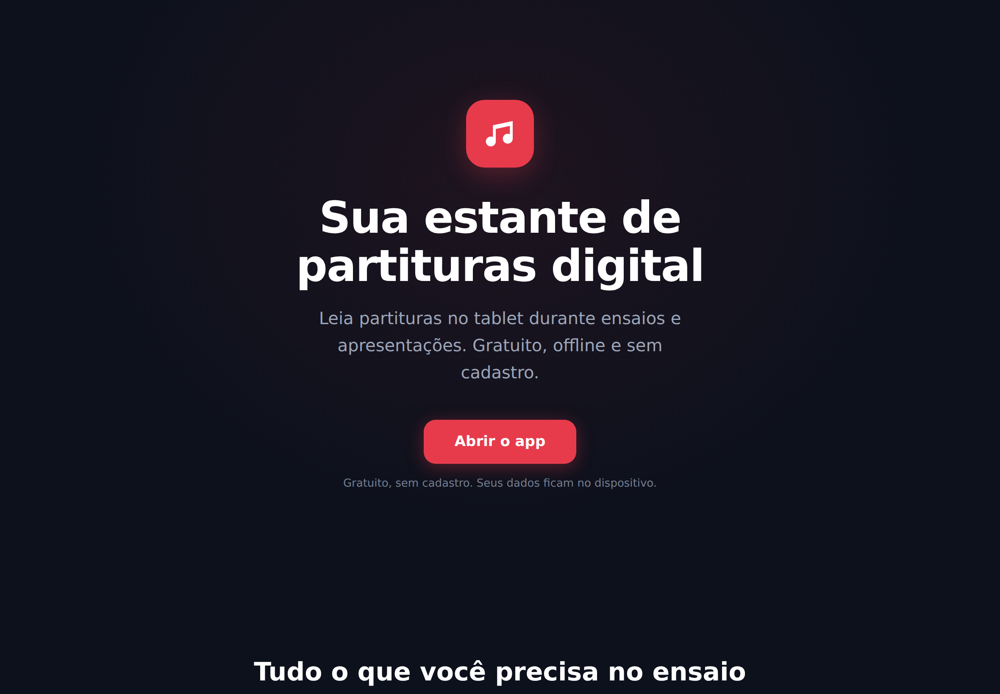
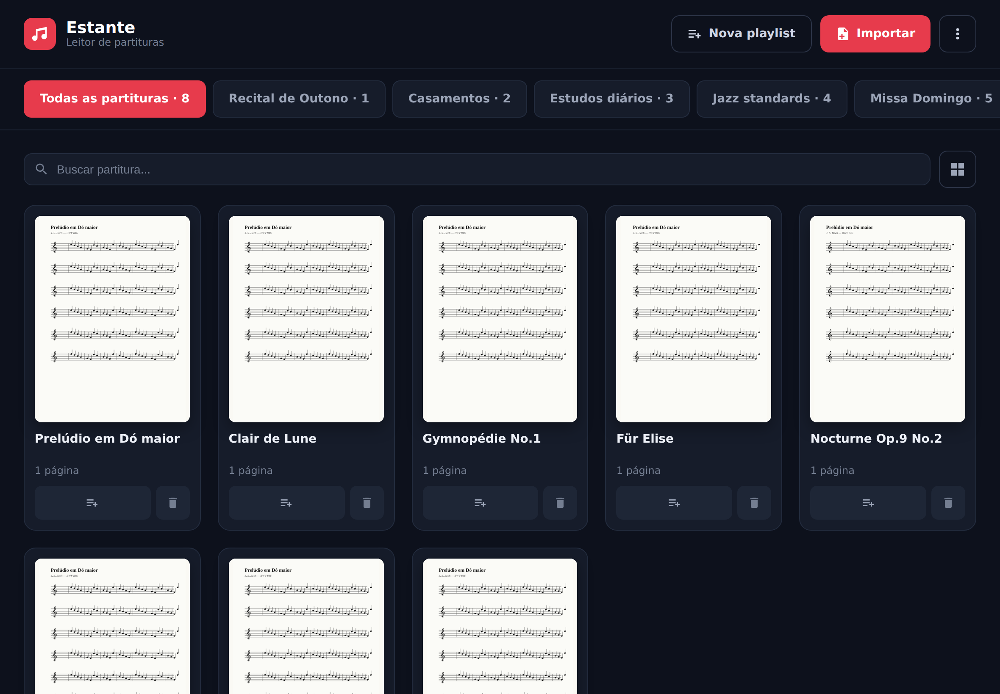
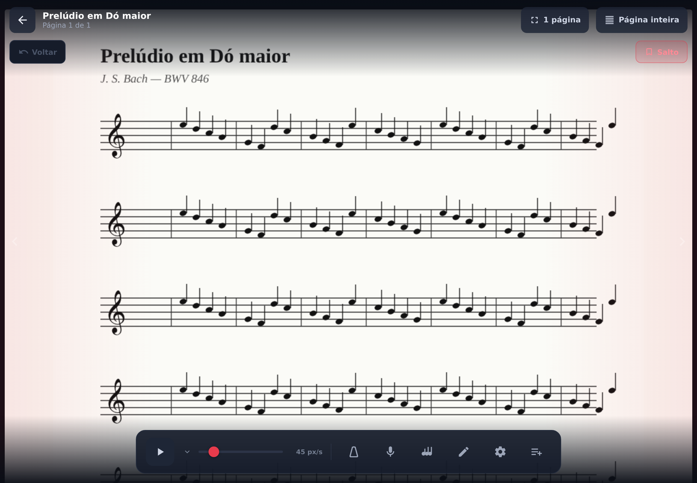

# Review de UX/UI & Backlog de Escalabilidade — Estante

> Avaliação do app com foco em três objetivos declarados:
> 1. **Parecer um app nativo** (não um site).
> 2. **Baixo carregamento cognitivo** e facilidade de uso.
> 3. **Escalar para uso em produção** (centenas de partituras/playlists).
>
> Data: 2026-06-21 · Base: `main` pós-merge do modo de rolagem por âncoras.

---

## 1. Evidências visuais

### Tela de início (Landing)

### Biblioteca (8 partituras, 10 playlists)

### Leitor de partitura

> As capturas foram geradas em viewport de tablet (1180×820 @2x) via Playwright,
> com dados semeados para reproduzir um cenário realista. Script em
> `docs/ux-review/` (ver histórico do PR).

---

## 2. Diagnóstico

### 2.1 O que já está bom
- Identidade visual coesa, dark theme agradável, tokens de design centralizados.
- Landing clara, com CTA único e promessa direta ("offline, sem cadastro").
- Leitor limpo, com a partitura como protagonista e chrome que some.
- Offline-first real (IndexedDB + localStorage + PWA).

### 2.2 Onde trava a escalabilidade (o ponto central)

**Playlists como abas horizontais não escalam.** Na captura da Biblioteca, com
apenas 10 playlists as abas já são cortadas na borda direita — não há como
**buscar**, **ordenar**, **favoritar**, **agrupar** ou sequer **rolar com affordance**
até uma playlist distante. Com 100 playlists o modelo quebra completamente.

Problemas concretos hoje:
- A busca (`searchQuery`) filtra **apenas partituras por nome dentro da aba ativa** —
  não busca playlists, nem por compositor/tag.
- **Sem ordenação** de partituras (nome, data de adição, último acesso) nem de playlists.
- **Sem metadados** nas partituras além de `name` e `pages`: não há compositor,
  gênero, tom, tags, favorito nem `lastOpenedAt`. Isso impede busca/filtro/ordenação ricos.
- **Sem renomear playlist** depois de criada; sem reordenar playlists; sem cor/ícone.
- A aba "Todas as partituras" vira uma lista única e plana que só cresce.

### 2.3 Carregamento cognitivo
- A barra inferior do Leitor tem **8 controles sem rótulo** numa linha só
  (play, velocidade, metrônomo, gravar, gravações, anotar, âncoras, gestos, +playlist).
  Em tablet menor isso aperta e a descoberta depende de tentativa-e-erro.
- Dois botões de "modo" no topo (ajuste de página × modo de rolagem) com rótulos
  textuais que ciclam — funcional, mas exige ler para saber o estado.
- Diálogos `confirm()`/`alert()` nativos do browser quebram a sensação de app nativo.

### 2.4 Sensação de "app nativo"
- Transição **instantânea** entre Biblioteca↔Leitor (troca de árvore React, sem
  animação). Apps nativos animam push/pop, o que ancora a navegação mentalmente.
- Sem *pull-to-refresh*, sem *skeletons* de carregamento, sem haptics.
- Thumbnails de PDF renderizam via canvas sem placeholder → "pisca" em branco.

### 2.5 Acessibilidade / robustez
- Boa cobertura de `aria-label`/`title` nos ícones.
- Falta foco visível consistente e navegação por teclado fora do Leitor.
- `window.location.reload()` após importar backup é abrupto.

---

## 3. Cobertura de testes (estado atual)

| Tipo | Situação |
|------|----------|
| Unitário | **0 testes**, nenhum framework instalado |
| Cobertura | **Nenhuma** instrumentação (sem vitest/c8/nyc) |
| E2E (Playwright) | 9 testes — só Landing + presença de elementos da Biblioteca |

**O que NÃO é testado hoje** (alto risco de regressão): importação de PDF/imagem,
criar/remover/reordenar playlists, navegação do Leitor, **âncoras** (recém-lançado),
metrônomo, gravação, backup/restore, i18n, persistência IndexedDB.

➡️ Proposta detalhada de coverage + comentário sticky no PR na seção 5.

---

## 4. Backlog priorizado

Prioridades: **P0** = destrava produção · **P1** = alto valor · **P2** = polish.
Esforço: S (≤meio dia) · M (1-2 dias) · L (3+ dias).

### Escalabilidade de biblioteca/playlists
| # | Item | Prioridade | Esforço |
|---|------|-----------|---------|
| E1 | Modelo de metadados nas partituras: `composer`, `tags[]`, `favorite`, `lastOpenedAt` (com migração) | P0 | M |
| E2 | Busca global: por nome **e** compositor **e** tag; busca também encontra playlists | P0 | M |
| E3 | Ordenação de partituras: nome, data de adição, último acesso, nº de páginas | P0 | S |
| E4 | Repensar navegação de playlists: sidebar/drawer pesquisável em vez de abas horizontais; com busca, favoritos no topo e contagem | P0 | L |
| E5 | Renomear, reordenar, definir cor/ícone e favoritar playlists | P1 | M |
| E6 | Filtro por tags (chips) e seção "Favoritas"/"Recentes" | P1 | M |
| E7 | Paginação/virtualização da grade para centenas de itens (perf de render) | P2 | M |

### Carregamento cognitivo & app nativo
| # | Item | Prioridade | Esforço |
|---|------|-----------|---------|
| C1 | Substituir `confirm()/alert()` por modais/toasts próprios | P1 | S |
| C2 | Agrupar/priorizar a toolbar do Leitor (ações primárias visíveis, secundárias em "mais") | P1 | M |
| C3 | Transições de navegação Biblioteca↔Leitor (push/pop animado) | P2 | M |
| C4 | Skeletons/placeholder para thumbnails e Leitor enquanto renderiza | P2 | S |
| C5 | Tooltips/rótulos discretos nos ícones da toolbar (primeiro uso) | P2 | S |

### Qualidade / testes
| # | Item | Prioridade | Esforço |
|---|------|-----------|---------|
| Q1 | Adicionar Vitest + cobertura v8; primeiros testes unitários de `lib/` (db, backup, i18n) e lógica de playlists | P0 | M |
| Q2 | Workflow de CI que gera cobertura e posta **comentário sticky** no PR com a variação | P0 | S |
| Q3 | Ampliar e2e: importar, criar playlist, abrir Leitor, navegar, âncoras | P1 | M |
| Q4 | Limiar mínimo de cobertura que falha o CI ao cair | P2 | S |

---

## 5. Proposta: cobertura + comentário sticky no PR

Como hoje só há e2e, o caminho mais rápido para um número de cobertura útil e
estável é **introduzir Vitest com cobertura v8** e cobrir primeiro os módulos
puros de `src/lib/` (alta densidade de lógica, baixo custo de teste), expandindo
depois para componentes e e2e instrumentado.

Fluxo de CI proposto:
1. Job `coverage`: `vitest run --coverage` (reporter `json-summary` + `text`).
2. Passo que lê `coverage/coverage-summary.json` e monta uma tabela
   (lines/branches/funcs/stmts) **comparando com a base**.
3. Posta/atualiza um **comentário único (sticky)** no PR — atualiza o mesmo
   comentário a cada push em vez de criar novos (marcador HTML oculto para reencontrar).

Isso dá acompanhamento contínuo da variação de cobertura, exatamente o fluxo pedido.

---

## 6. Sequência sugerida de PRs

1. **PR — Qualidade/coverage (Q1+Q2):** Vitest + v8 + comentário sticky. Entra
   primeiro para já medir tudo que vier depois.
2. **PR — Metadados + busca + ordenação (E1+E2+E3):** destrava a escalabilidade
   "barata" sem redesenhar navegação.
3. **PR — Navegação de playlists (E4+E5+E6):** a mudança estrutural maior.
4. **PRs de polish (C*):** incrementais.
