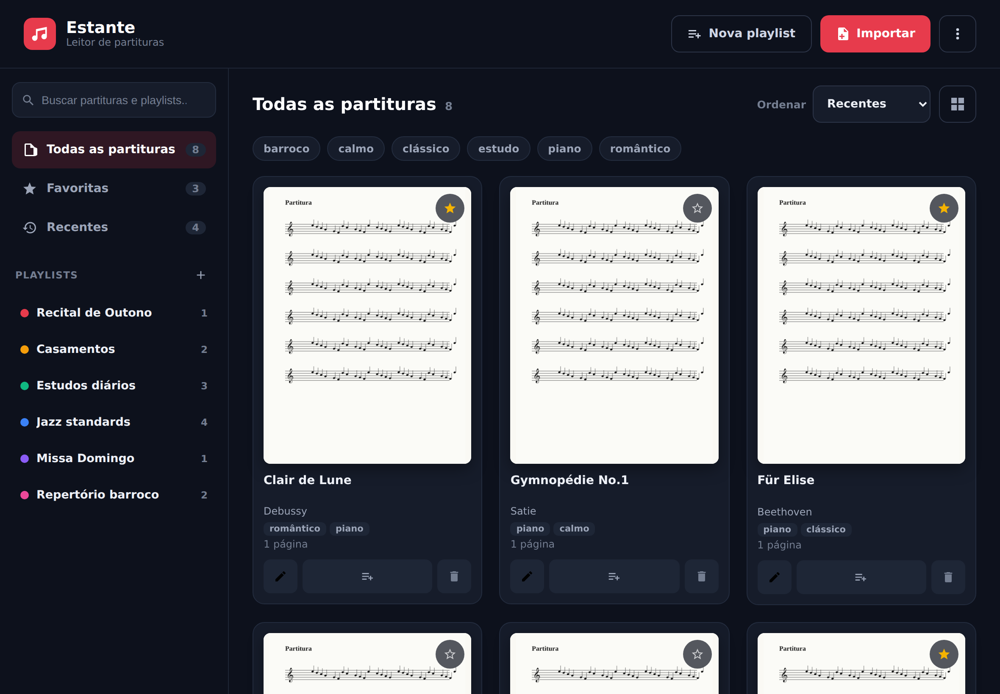
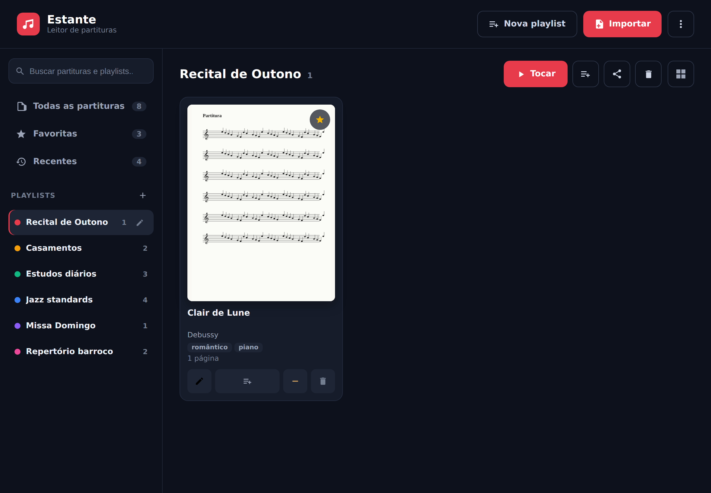
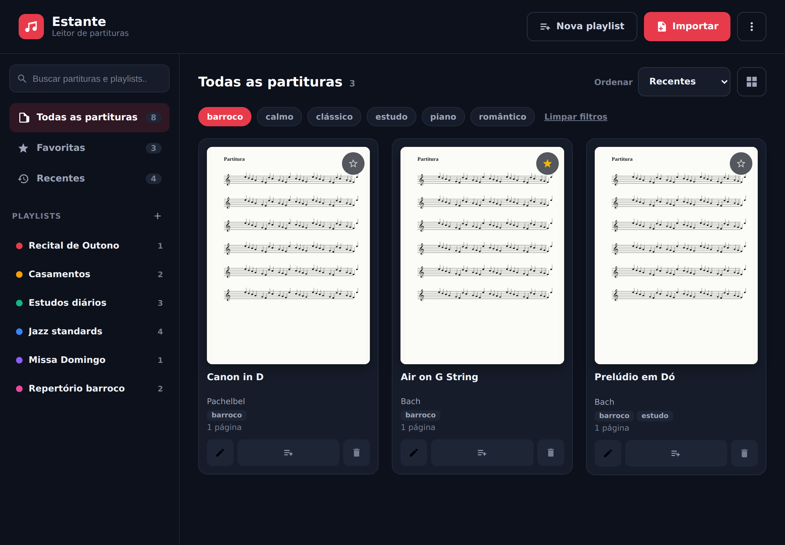

# Redesenho da navegação — evidências

Implementação dos itens E1–E6 do backlog (ver `../README.md`).
ADRs: `../../adr/011-library-scaling.md`, `../../adr/012-playlist-sidebar-navigation.md`.

### Biblioteca — sidebar pesquisável, seções e tags

Sidebar com busca global (partituras **e** playlists), seções **Todas / Favoritas /
Recentes** com contagem, lista de playlists com cor/contagem/edição e reordenação.
Cards mostram compositor, tags e estrela de favorito. Ordenação e filtro por tags no topo.

### Playlist ativa

Ações da playlist (tocar, adicionar em massa, compartilhar, excluir) no cabeçalho do
conteúdo; a playlist ativa fica destacada na sidebar.

### Filtro por tag

Chips de tag filtram a grade (AND entre tags); "Limpar filtros" reseta.
